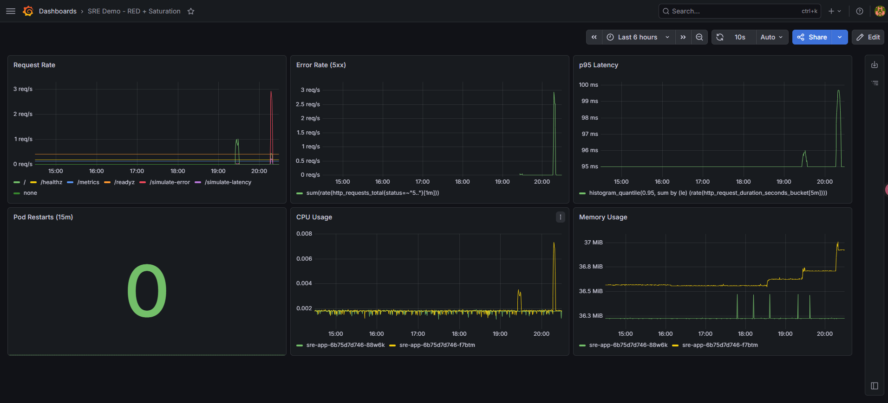
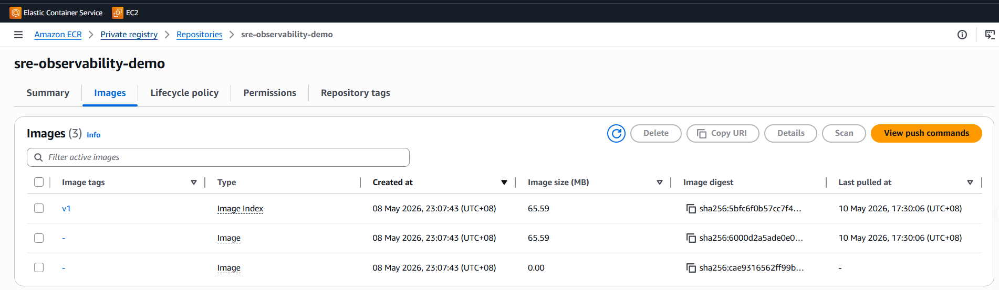
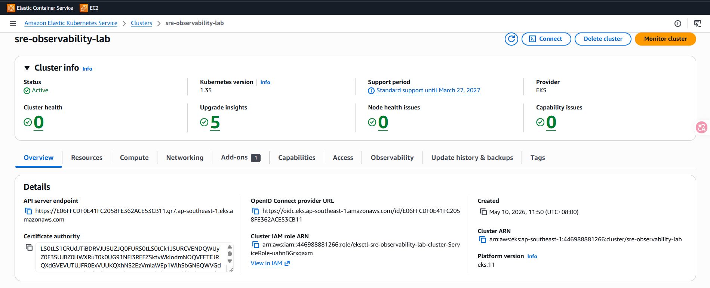
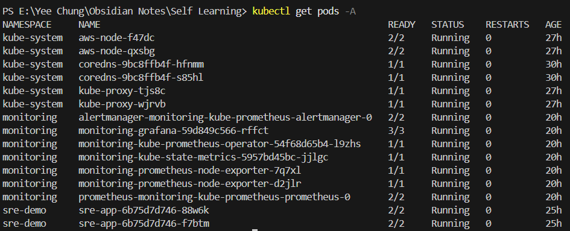
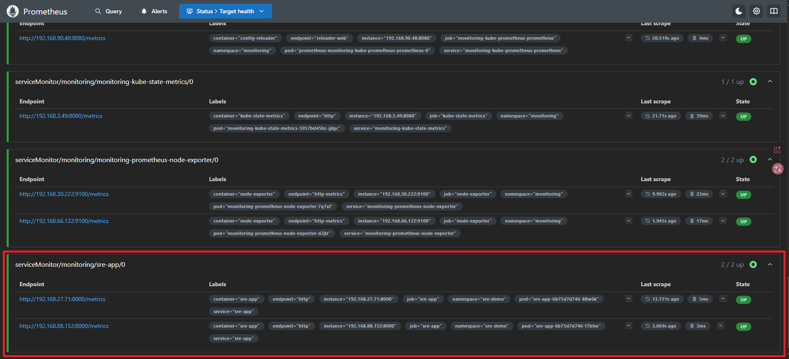
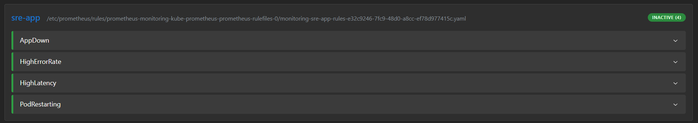
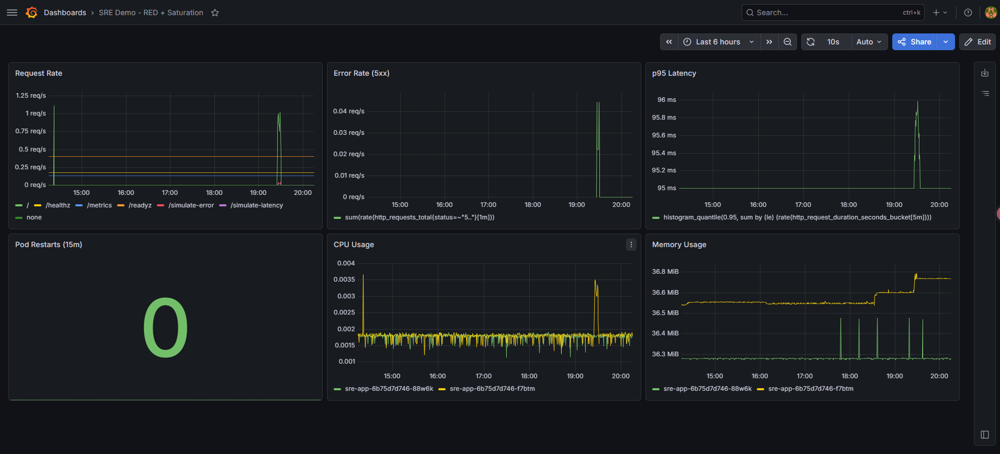
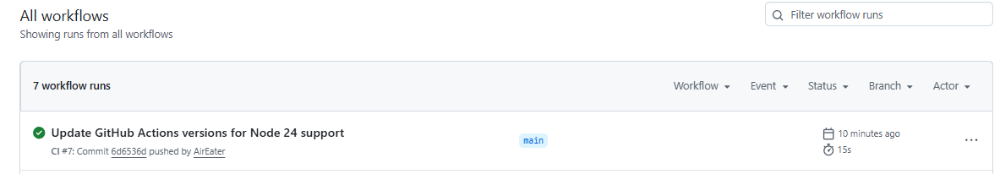
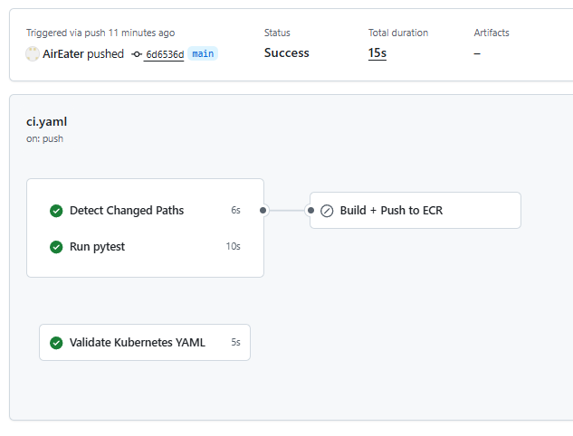

# SRE Observability Lab


An end-to-end SRE observability stack that deploys a FastAPI service to Amazon EKS, instruments it with Prometheus metrics, visualizes RED signals in Grafana, and ships container images to Amazon ECR through GitHub Actions.



## What This Demonstrates

- Built a Python FastAPI service with health checks, readiness checks, Prometheus metrics, and incident simulation endpoints.
- Containerized the service with Docker and published versioned images to Amazon ECR.
- Deployed the app to Amazon EKS using Kubernetes manifests with replicas, probes, ConfigMap, Secret, init container, sidecar, and resource limits.
- Added Prometheus scraping with `ServiceMonitor`, alerting with `PrometheusRule`, and a Grafana RED + saturation dashboard.
- Added GitHub Actions automation for tests, Kubernetes manifest validation, and path-aware image builds (only rebuilds when app code or Dockerfile changes).


## Architecture


More detail: [Architecture](docs/ARCHITECTURE.md)

## Implementation

### Application

The app exposes operational endpoints used by Kubernetes and Prometheus:

- `/healthz` for liveness checks
- `/readyz` for readiness checks
- `/metrics` for Prometheus scraping
- `/simulate-error`, `/simulate-latency`, and `/simulate-cpu` for controlled incident signals

### Containerization and ECR

The service is packaged with a small Python 3.11 Docker image and pushed to Amazon ECR. The CI pipeline tags images with both the immutable Git SHA and `latest`.



### Kubernetes Infrastructure

The app runs in the `sre-demo` namespace on EKS with two replicas, liveness/readiness probes, resource requests/limits, an init container, and a sidecar container.





### Observability

Prometheus discovers the app through a `ServiceMonitor` and evaluates four alert rules: app down, high error rate, high latency, and pod restarts.





Grafana visualizes request rate, 5xx errors, p95 latency, pod restarts, CPU usage, and memory usage. I captured both a normal traffic baseline and an incident window to show how the same dashboard supports comparison-based diagnosis.

#### Normal Baseline

The normal run started at 7:25pm and ran for 5 minutes with steady traffic, occasional low-rate errors, and occasional latency. This establishes what "healthy enough" looks like before comparing against an incident.



#### Incident Window

The incident run started at 8:16pm and ran for 3 minutes, increasing 5xx errors and slow requests. The dashboard shows the SRE signal shift: error rate rises, latency increases, and the abnormal window becomes visible without reading application logs first.


### Automation

GitHub Actions runs:

- `test`: installs dependencies and runs `pytest`
- `changes`: detects whether Docker image inputs changed
- `docker-build-push`: builds and pushes to ECR only when `app/**`, `Dockerfile`, or `.dockerignore` changed
- `k8s-validate`: validates Kubernetes manifests with `kubeconform`





## Tech Stack

`Python` `FastAPI` `pytest` `Docker` `Amazon ECR` `Amazon EKS` `Kubernetes` `Helm` `Prometheus` `Grafana` `GitHub Actions` `kubeconform`

## Local Development

```powershell
# Install dependencies
pip install -r app/requirements.txt

# Run tests
pytest app/tests/ -v

# Run the app locally
uvicorn app.main:app --host 0.0.0.0 --port 8000

# Build and run the container
docker build -t sre-observability-demo:local .
docker run --rm -p 8000:8000 sre-observability-demo:local
```

## Verification
 
Keep the `uvicorn` or `docker run` process running in one terminal, then run these checks from a second PowerShell terminal.

```powershell
# Health check should return {"status":"ok"}
curl.exe http://localhost:8000/healthz

# Metrics endpoint should expose Prometheus text format
curl.exe http://localhost:8000/metrics

# Simulate a 500 response and verify it appears in metrics
curl.exe http://localhost:8000/simulate-error
curl.exe http://localhost:8000/metrics
```

## CI and Delivery Scope

This project implements CI plus artifact delivery to ECR:

```text
git push -> tests -> manifest validation -> docker build -> push ECR
```

It intentionally does not implement full continuous deployment because the EKS cluster is deleted when not in use to control AWS cost.

A full CD flow would add:

```text
build image -> push ECR -> kubectl set image -> rollout status
```

## Scope and Limitations

- This is a learning lab, not a production SRE platform.
- The EKS cluster was created for the lab and deleted after screenshots to avoid ongoing AWS cost.
- `k8s/secret.example.yaml` is committed for structure; the real `k8s/secret.yaml` is ignored.
- Alert thresholds are intentionally simple and demo-oriented, not SLO burn-rate alerts.
